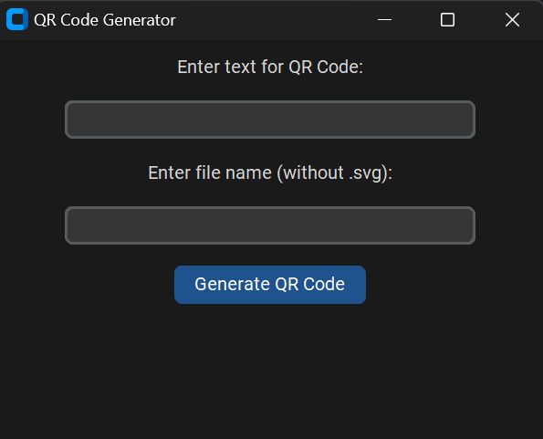

# Simple QR Code Generator for Text



It is a simple app to generate QR Code from inputed text or link etc.

There is a Window interface, where a user can write text and name for output svg image of QR Code.

## Requirements

To make it work you need:
- **Installed customtkinter**:

  _Note: If you don't have it, type in cmd:_  
  ```bash
  pip install customtkinter
  ```
- **Installed qrcode**:

  _Note: If you don't have it, type in cmd:_  
  ```bash
  pip install qrcode
  ```

### OR you can write in Command Prompt:

  ```bash
  pip install -r requirements.txt
  ```

### Written in Python v3.9
